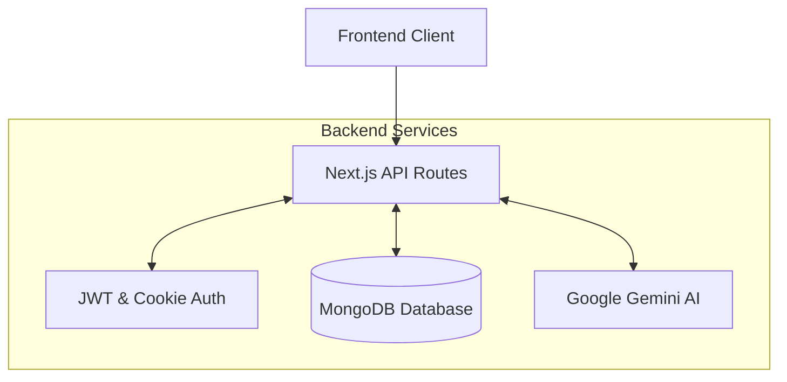
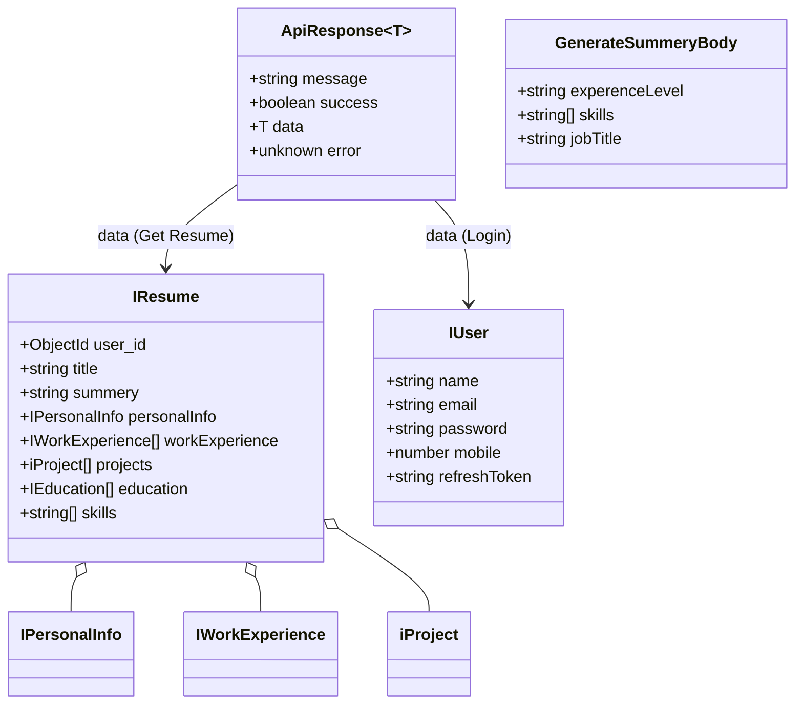
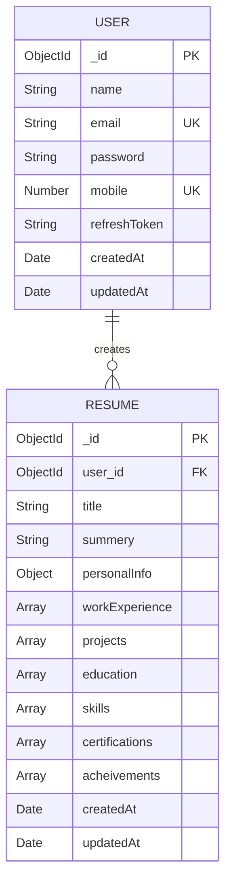
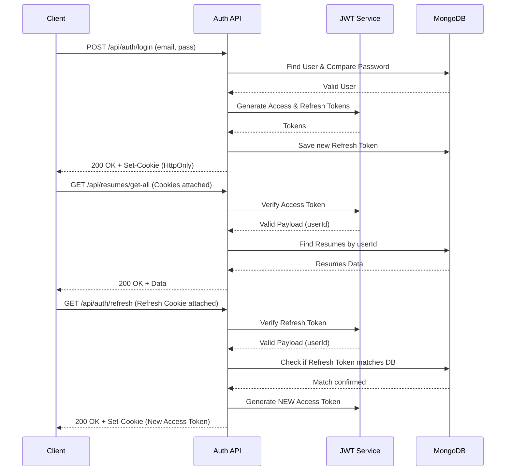
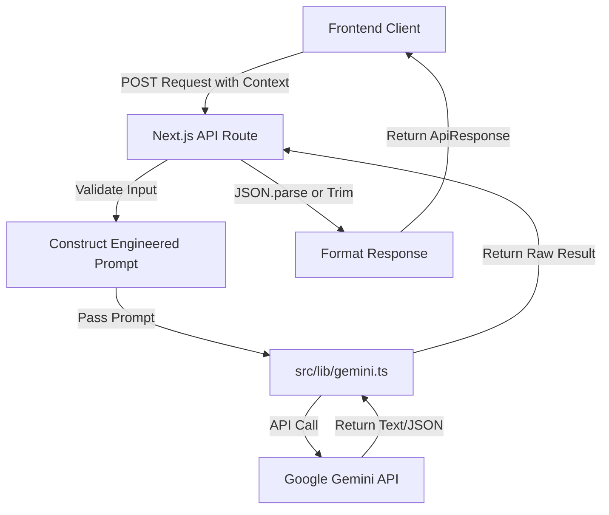
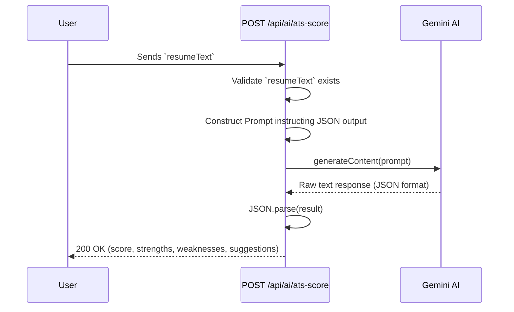
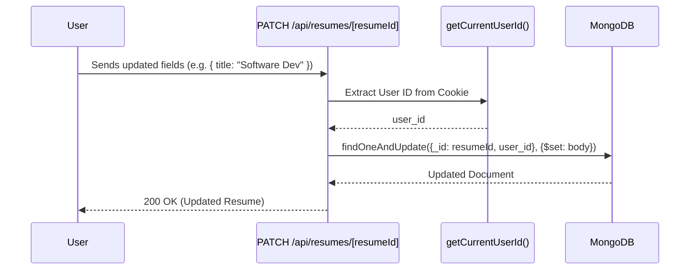

# BACKEND ARCHITECTURE AND DEVELOPMENT GUIDE

## SECTION 1: PROJECT OVERVIEW

### What this project is
This project is the backend service for a modern Resume Builder application. It is built using the Next.js App Router API routes to handle authentication, resume management, and AI-powered content generation. 

### Why it exists
The project exists to provide users with a seamless, AI-enhanced experience for creating and optimizing resumes. It simplifies the process of writing professional summaries, generating skills, describing work experience/projects, and checking Applicant Tracking System (ATS) compatibility.

### Who uses it
- **End-users (Job Seekers):** Interacting with the client application to build and refine their resumes.
- **Developers & AI Agents:** Maintaining, extending, and debugging the system.

### Main functionality
1. **User Authentication:** Secure registration, login, logout, and token refresh mechanisms using JWT and HttpOnly Cookies.
2. **Resume CRUD Operations:** Creating, retrieving, and updating resume data structure (personal info, experience, education, projects, skills).
3. **AI Integration:** Leveraging Google's Gemini AI to auto-generate and improve resume content, and score resumes against ATS standards.

### Current implementation status
The backend architecture is largely foundational and functional. Core authentication is implemented. Resume CRUD operations are available (Create, Read, Update). A comprehensive suite of AI endpoints is fully implemented and connected to Gemini. 

### High-Level Architecture Overview

---

## SECTION 2: TECHNOLOGY STACK

### Next.js App Router
* **Purpose:** Framework for building the React frontend and backend API endpoints.
* **Where it is used:** `src/app/api/...` for all RESTful API routes.
* **Why it was chosen:** Allows seamless full-stack development within a single repository. The App Router provides a modern file-system based routing mechanism.
* **Interaction:** Acts as the entry point for all client requests, routing them to appropriate controllers.

### TypeScript
* **Purpose:** Adds static typing to JavaScript.
* **Where it is used:** Throughout the entire codebase (`.ts` and `.tsx` files).
* **Why it was chosen:** Prevents runtime errors, provides excellent developer tooling/autocomplete, and explicitly defines data structures (crucial for AI agents and human developers).
* **Interaction:** Compiles to JavaScript; enforces structure on Mongoose models, API request bodies, and API responses.

### MongoDB
* **Purpose:** Primary NoSQL database.
* **Where it is used:** Cloud-hosted (accessed via `MONGODB_URL`).
* **Why it was chosen:** Flexible document schema aligns perfectly with the nested, hierarchical nature of Resume data (e.g., arrays of experiences, projects).
* **Interaction:** Stores Users and Resumes. Accessed exclusively through Mongoose.

### Mongoose
* **Purpose:** Object Data Modeling (ODM) library for MongoDB.
* **Where it is used:** `src/models/` and `src/lib/mongoose.ts`.
* **Why it was chosen:** Provides schema validation, relationship mapping (`populate`), and lifecycle hooks (e.g., pre-save password hashing).
* **Interaction:** Wraps MongoDB interactions in strong types and validates data before saving.

### JWT (JSON Web Tokens)
* **Purpose:** Stateless authentication mechanism.
* **Where it is used:** `src/lib/jwt.ts`, Auth routes, and `getCurrentUser` helpers.
* **Why it was chosen:** Scalable authentication that doesn't require session storage in the database (except for refresh token tracking).
* **Interaction:** Generates Access Tokens (short-lived, 15m) and Refresh Tokens (long-lived, 7d).

### Cookies
* **Purpose:** Secure storage mechanism for JWTs on the client.
* **Where it is used:** `src/lib/cookies.ts`.
* **Why it was chosen:** `HttpOnly`, `Secure`, `SameSite="strict"` cookies prevent XSS attacks and CSRF vulnerabilities.
* **Interaction:** Next.js `cookies()` API reads/writes tokens automatically during requests.

### Gemini AI (Google GenAI)
* **Purpose:** Large Language Model used to generate and analyze text.
* **Where it is used:** `src/lib/gemini.ts` and `src/app/api/ai/...`.
* **Why it was chosen:** Fast, capable, and cost-effective model (`gemini-3.5-flash`) for text generation tasks like summarizing and ATS scoring.
* **Interaction:** API routes send engineered prompts to Gemini, which returns JSON strings or plain text that are parsed and sent to the client.

### REST APIs
* **Purpose:** Communication standard between frontend and backend.
* **Where it is used:** All endpoints in `src/app/api/`.
* **Why it was chosen:** Standard, well-understood architectural style for stateless communication.
* **Interaction:** Uses standard HTTP methods (GET, POST, PATCH) and returns standard JSON responses.

---

## SECTION 3: COMPLETE FOLDER STRUCTURE ANALYSIS

### `src/app`
* **Purpose:** Next.js App Router root.
* **Responsibilities:** Defines the application layout, global CSS, and API routes.
* **Dependencies:** Next.js.
* **Relationships:** Parent to `api` and `helpers`.

### `src/app/api`
* **Purpose:** Houses all backend REST API endpoints.
* **Responsibilities:** Receiving HTTP requests, validating input, triggering business logic, returning HTTP responses.
* **Dependencies:** `lib`, `models`, `types`, `helpers`.
* **Relationships:** Organized into `ai`, `auth`, `resumes`, and `temp` domains.

### `src/app/helpers`
* **Purpose:** Domain-specific helper functions (specifically closely tied to the request lifecycle).
* **Responsibilities:** Extracting the current user from the request context and handling token rotation.
* **Important Files:** 
  * `getCurrentUser.ts`: Validates the access token from cookies and fetches the user from the DB. Used by almost all protected routes. *Potential Improvement:* Move to `src/lib` or `src/middlewares` for better architectural separation.

### `src/lib`
* **Purpose:** Core utility functions, configurations, and external service wrappers.
* **Responsibilities:** Database connection, cookie management, JWT signing/verifying, AI model initialization.
* **Important Files:**
  * `cookies.ts`: Abstraction for setting/clearing HttpOnly cookies.
  * `gemini.ts`: Initializes the `GoogleGenAI` client and exports a `main(prompt)` execution function.
  * `jwt.ts`: Wrappers around `jsonwebtoken` for signing and verifying access/refresh tokens.
  * `mongoose.ts`: Handles the MongoDB connection logic.
  * `getCurrentUser.ts`: A duplicate/lighter version of the helper in `app/helpers`. *Potential Improvement:* Consolidate `src/lib/getCurrentUser.ts` and `src/app/helpers/getCurrentUser.ts` to avoid confusion.

### `src/models`
* **Purpose:** Mongoose schema definitions.
* **Responsibilities:** Defining data shapes, default values, and pre-save hooks (like password hashing).
* **Important Files:**
  * `User.model.ts`: Defines user schema and password comparison methods.
  * `Resume.model.ts`: Defines the complex, highly-nested resume schema.

### `src/types`
* **Purpose:** Centralized TypeScript interfaces and types.
* **Responsibilities:** Ensuring type safety across requests, responses, models, and AI logic.
* **Important Files:**
  * `ai.types.ts`: Defines expected request bodies for AI endpoints.
  * `apiResponse.type.ts`: Standardizes the API response format (`{ message, data, error, success }`).
  * `jwt.types.ts`: Defines the JWT payload (`{ id, email }`).
  * `resume.type.ts`: TypeScript interfaces mirroring the Resume Mongoose model.
  * `user.type.ts`: TypeScript interfaces mirroring the User Mongoose model.

### `src/middlewares`
* **Purpose:** Intended for Next.js middleware (e.g., edge route protection).
* **Status:** Currently empty. *Potential Improvement:* Implement a global `middleware.ts` at the `src` root to protect routes instead of manually calling `getCurrentUser()` in every API route.

---

## SECTION 4: TYPESCRIPT TYPE SYSTEM DOCUMENTATION

TypeScript enforces a strict contract between the database, the API boundaries, and the AI integration. 

### Key Types

#### `apiResponse.type.ts`
* **Purpose:** Standardizes the shape of every single HTTP response from the backend.
* **Fields:** `message` (string), `data` (optional generic T), `error` (optional unknown), `success` (boolean).
* **Usage:** Used as the return type wrapper in all API routes.

#### `user.type.ts`
* **Purpose:** Represents the core User entity.
* **Fields:** `name`, `email`, `password`, `mobile`, `refreshToken`.
* **Usage:** Used to type the Mongoose `UserDocument`.

#### `resume.type.ts`
* **Purpose:** Represents the complex Resume entity with nested sub-documents.
* **Fields:** `personalInfo`, `workExperience`, `projects`, `education`, `user_id`, `title`, `summery`, `certifications`, `acheivements`, `skills`.
* **Usage:** Types the Mongoose Resume model and is used when creating/updating resumes.

#### `ai.types.ts`
* **Purpose:** Defines the exact request body structures expected by various AI generation endpoints.
* **Interfaces:** `GenerateSummeryBody`, `GenerateSkillsBody`, `GenerateProjectDescriptionBody`, `GenerateExperienceDescriptionBody`, `ImproveContentBody`, `ATSScoreBody`.
* **Usage:** Used in `req.json()` parsing inside `src/app/api/ai/...` routes to ensure the client sent the correct data.

#### `jwt.types.ts`
* **Purpose:** Defines the payload encoded into the JSON Web Tokens.
* **Fields:** `id` (string), `email` (optional string).
* **Usage:** Used in `generateAccessToken` and `generateRefreshToken`.

### Type Relationships Diagram

**How TypeScript improves maintainability:** By defining `GenerateSummeryBody`, the developer knows exactly what parameters the AI prompt requires. By defining `ApiResponse`, the frontend knows exactly how to parse the result.

---

## SECTION 5: DATABASE DOCUMENTATION

### `User` Model
* **Purpose:** Stores user credentials and authentication state.
* **Fields:**
  * `name`: String, required.
  * `email`: String, required, unique, lowercase.
  * `password`: String, required, minLength 6, `select: false` (hidden by default to prevent accidental leakage).
  * `mobile`: Number, required, unique.
  * `refreshToken`: String, stores the current active refresh token for rotation/revocation.
* **Validation:** Mongoose built-in validation for required fields and unique constraints.
* **Hooks:** `pre('save')` automatically hashes the password using `bcrypt` if modified.
* **Methods:** `comparePassword` uses `bcrypt.compare` to verify login attempts.

### `Resume` Model
* **Purpose:** Stores all resume data linked to a specific user.
* **Fields:**
  * `user_id`: ObjectId ref to 'User'. Required.
  * `title`: String, default "My Resume".
  * `summery`: String, default "My Resume summery".
  * `personalInfo`: Object containing fullname, email, mobile, country, etc.
  * `workExperience`: Array of objects (company, position, startDate, endDate, description).
  * `projects`: Array of objects (project, description, githubLink, liveLink, techStack).
  * `education`: Array of objects.
  * `skills`: Array of Strings. Required.
  * `certifications`, `acheivements`: Arrays of Strings.
* **Relationships:** One-to-Many. One User can have many Resumes. `user_id` acts as the foreign key.

### Entity Relationship Diagram

---

## SECTION 6: AUTHENTICATION SYSTEM

The application uses a robust, cookie-based JWT authentication architecture.

### Architecture Components
* **Registration:** Validates data, ensures unique email/mobile, creates user, hashes password, generates Access + Refresh tokens, sets HttpOnly cookies.
* **Login:** Verifies email and password using `bcrypt`, generates new tokens, updates `refreshToken` in DB, sets HttpOnly cookies.
* **Logout:** Clears the `refreshToken` in the DB and deletes the cookies from the browser.
* **Access Token:** Short-lived (15 minutes). Used to verify identity on every protected request.
* **Refresh Token:** Long-lived (7 days). Used to silently request a new Access Token when it expires.
* **Token Rotation (`/api/auth/refresh`):** Reads the refresh cookie, verifies it, checks if it matches the DB, generates a new access token, and sets the new access cookie.

### Authentication Sequence Flow

---

## SECTION 7: API DOCUMENTATION

### 1. Auth Routes

#### `POST /api/auth/register`
* **Purpose:** Register a new user.
* **Auth Required:** No
* **Body:** `RegisterBody` (name, email, password, mobile)
* **Business Logic:** Checks for existing user by email or mobile. Creates user. Generates tokens. Sets cookies.
* **Errors:** 400 (Missing fields, User exists), 500 (Server error).

#### `POST /api/auth/login`
* **Purpose:** Authenticate a user.
* **Auth Required:** No
* **Body:** `LooginBody` (email, password)
* **Business Logic:** Finds user, compares password hash. Generates tokens. Updates DB. Sets cookies.

#### `GET /api/auth/logout`
* **Purpose:** Log a user out.
* **Auth Required:** Yes
* **Business Logic:** Fetches current user, sets DB `refreshToken` to null, clears auth cookies.

#### `GET /api/auth/me`
* **Purpose:** Get current logged-in user profile.
* **Auth Required:** Yes
* **Business Logic:** Calls `getCurrentUser()` helper and returns user data.

#### `GET /api/auth/refresh`
* **Purpose:** Rotate access token using a valid refresh token.
* **Auth Required:** Refresh Cookie Only
* **Business Logic:** Validates refresh token, checks DB matching, generates new access token, sets new cookie.

### 2. Resume Routes

#### `POST /api/resumes/create`
* **Purpose:** Initialize a new blank resume.
* **Auth Required:** Yes
* **Business Logic:** Creates a new `resumeModel` document linked to `user_id` with default empty arrays/objects.

#### `GET /api/resumes/get-all`
* **Purpose:** Fetch all resumes owned by the current user.
* **Auth Required:** Yes
* **Business Logic:** `resumeModel.find({ user_id })`.

#### `GET /api/resumes/[resumeId]`
* **Purpose:** Fetch a specific resume.
* **Auth Required:** Yes
* **Business Logic:** `resumeModel.findOne({ _id: resumeId, user_id })`. Secures against accessing other users' resumes.

#### `PATCH /api/resumes/[resumeId]`
* **Purpose:** Update a specific resume.
* **Auth Required:** Yes
* **Body:** Partial `IResume` object.
* **Business Logic:** Uses `findOneAndUpdate` with `$set`.

### 3. AI Routes

*All AI routes require the appropriate body structure and utilize the Gemini API via `src/lib/gemini.ts`.*

#### `POST /api/ai/generate-summary`
* **Body:** `experenceLevel`, `skills`, `jobTitle`.
* **Output:** 4-6 line professional summary string.

#### `POST /api/ai/generate-skills`
* **Body:** `expreenceLevel`, `jobTitle`.
* **Output:** JSON string parsed array of 10-15 skills.

#### `POST /api/ai/generate-experience-description`
* **Body:** `company`, `position`, `startDate`, `endDate`, `skills`.
* **Output:** JSON array of 4 bullet points.

#### `POST /api/ai/generate-project-description`
* **Body:** `projectTitle`, `jobTitle`, `techStack`.
* **Output:** JSON array of 4 bullet points.

#### `POST /api/ai/inprove-content`
* **Body:** `content`.
* **Output:** Improved string content.

#### `POST /api/ai/ats-score`
* **Body:** `resumeText` (Entire resume content parsed to string).
* **Output:** Detailed JSON object containing `score`, `strengths`, `weaknesses`, and `suggestions`.

---

## SECTION 8: HELPER FUNCTIONS

### `src/app/helpers/getCurrentUser.ts`
* **`getCurrentUser()`**
  * **Purpose:** Validates the incoming request and retrieves the User document.
  * **Dependencies:** `cookies()`, `verifyAccessToken()`, `connectDB()`, `userModel`.
  * **Usage:** Used by `/api/auth/me`, `/api/auth/logout`.
* **`rotateToken()`**
  * **Purpose:** Executes the refresh token logic.
  * **Dependencies:** `cookies()`, `verifyRefreshToken()`, `userModel`, `generateAccessToken()`, `setAccessCookie()`.

### `src/lib/getCurrentUser.ts`
* **`getCurrentUserId()`**
  * **Purpose:** Lightweight version that ONLY returns the user ID from the token payload without querying the DB.
  * **Usage:** Used heavily in Resume CRUD routes (`create`, `get-all`, `[resumeId]`) because only the ID is needed for foreign key operations, making it highly efficient.

### `src/lib/jwt.ts`
* **`generateAccessToken(payload)` & `generateRefreshToken(payload)`**
  * **Purpose:** Wrapper around `jsonwebtoken.sign`.
* **`verifyAccessToken(token)` & `verifyRefreshToken(token)`**
  * **Purpose:** Wrapper around `jsonwebtoken.verify`. Returns `false` instead of throwing errors to allow graceful handling.

### `src/lib/cookies.ts`
* **`setAccessCookie(token)` / `setRefreshCookie(token)` / `clearAuthCookies()`**
  * **Purpose:** Centralized Next.js `cookies()` mutation functions to enforce consistent security flags (`httpOnly`, `secure`, `sameSite: "strict"`).

---

## SECTION 9: AI SYSTEM DOCUMENTATION

The AI system is built entirely around Google's Gemini (`gemini-3.5-flash`). The core philosophy is **Prompt Engineering -> Execution -> Parsing -> API Response**.

### AI Workflow

### Prompt Engineering Strategies Used
1. **Role Playing:** Prompts start with "You are an ATS resume expert."
2. **Context Injection:** Variables like `${jobTitle}` and `${skills}` are directly interpolated.
3. **Strict Formatting Rules:** Prompts explicitly demand "Return ONLY valid JSON" and "No markdown formatting" to ensure `JSON.parse()` doesn't throw errors in the API route.

### Error Handling
If Gemini fails, times out, or returns invalid JSON (causing `JSON.parse` to fail), the route catches the error and returns a standard `500 Something went wrong` ApiResponse.

---

## SECTION 10: COMPLETE REQUEST FLOW ANALYSIS

### 1. ATS Score Analysis Flow

### 2. Resume Update Flow

---

## SECTION 11: CURRENT PROJECT STATUS

### Current Development Status

*   **Authentication:** 100% (Completed. Secure, HTTP-only, token rotation implemented).
*   **Database Schema & Models:** 100% (Completed).
*   **Resume CRUD API:** 90% (Completed. Missing Resume Deletion endpoint).
*   **AI Integrations:** 100% (Completed. Prompts are well-engineered and parsing is robust).
*   **Middleware Protection:** 0% (Not Started. Route protection relies on manual helper calls in each route).
*   **Input Validation:** 50% (In Progress. Basic checks exist, but no robust schema validation like Zod).

**Overall Backend Completion Estimate:** 85%

---

## SECTION 12: CODE QUALITY REVIEW

### Strengths
*   **Standardized Responses:** Using `ApiResponse` type everywhere ensures frontend developers have a predictable interface.
*   **Security:** Using HttpOnly cookies instead of localStorage for JWTs is a massive security win against XSS.
*   **AI Prompting:** Prompts specifically request JSON and forbid markdown, preventing parsing crashes.
*   **Separation of Concerns:** DB connection, Cookie handling, and AI logic are cleanly separated into `src/lib`.

### Weaknesses & Risks
*   **Missing Zod Validation:** Request body validation is currently manual (e.g., `if (!name || !email)`). This is error-prone.
*   **Redundant Auth Checks:** Every protected route manually calls `getCurrentUser` or `getCurrentUserId`. If a developer forgets this on a new route, it's a security hole.
*   **Error Handling:** Many `catch (error)` blocks just return "Something went wrong". Errors should be typed and appropriately handled (e.g., returning 400 for MongoDB CastErrors).
*   **Duplicate Helpers:** `src/lib/getCurrentUser.ts` and `src/app/helpers/getCurrentUser.ts` do slightly different things but have similar names.

### Technical Debt & Suggested Improvements
1.  **Implement Next.js Middleware:** Create `src/middleware.ts` to automatically protect `/api/resumes/*` and `/api/auth/logout|me` routes. This removes the need to manually check tokens in every controller.
2.  **Integrate Zod:** Replace manual body validation with Zod schemas.
3.  **Refactor User Helper:** Consolidate `getCurrentUser` logic.

---

## SECTION 13: MISSING FEATURES

Based on standard Resume Builder applications and analyzing the current codebase, the following features are missing from the backend:

*   **DELETE /api/resumes/[resumeId]:** Users cannot currently delete a resume.
*   **Resume Duplication API:** Endpoint to clone an existing resume.
*   **PDF Export Generation:** Backend logic (e.g., using Puppeteer or a PDF library) to generate downloadable PDFs.
*   **Resume Themes/Templates:** No field in the `Resume` model exists to save the selected visual template/theme.
*   **Image Upload (Profile Picture):** No AWS S3 / Cloudinary integration for handling profile pictures.

---

## SECTION 14: DEVELOPMENT ROADMAP

### What Should Be Built Next

#### Priority 1: Core System Hardening
*   **Implement Next.js Edge Middleware:** Centralize JWT verification. **Why:** Eliminates security risks of forgetting to protect new routes.
*   **Resume Deletion Endpoint:** Implement `DELETE /api/resumes/[resumeId]`. **Why:** Basic CRUD necessity.
*   **Zod Input Validation:** Add Zod. **Why:** Prevents malformed data from reaching MongoDB or Gemini.

#### Priority 2: Feature Enhancements
*   **Template Preferences:** Update `Resume.model.ts` to include `themeColor` and `templateId`. Update API routes to accept these. **Why:** Required for frontend styling features.
*   **PDF Generation API:** Create a route that takes a resume ID, fetches the data, and renders a PDF buffer. **Why:** Core functionality for a resume builder.

#### Priority 3: Advanced AI & User Features
*   **Cover Letter Generator API:** Use Gemini to generate a cover letter based on a specific Resume ID and a target Job Description.
*   **User Profile Updates:** Endpoint to update user name/mobile/password.

---

## SECTION 15: CONTEXT FOR FUTURE AI AGENTS

### Context For Future AI Agents

**Project Purpose:** An AI-powered Next.js API for building, managing, and optimizing user resumes using Google Gemini.

**Architecture:** Next.js App Router API routes (`/api/...`). Stateless REST design. Business logic inside route handlers. Shared logic in `src/lib`.

**Database:** MongoDB via Mongoose. Two primary models: `User` (handles credentials) and `Resume` (handles highly nested resume arrays).

**Authentication:** JWT-based. Short-lived Access Tokens (15m) and long-lived Refresh Tokens (7d). Stored in `HttpOnly` secure cookies. Next.js `cookies()` API is used to read/write.

**AI Features:** Integration with `@google/genai` (`gemini-3.5-flash`). Prompts are engineered to return JSON strings, which are parsed in the API routes. 

**Current Progress:** Full Auth is done. Resume Create/Read/Update is done. AI generation is done.

**Pending Work:** Needs a Resume Delete endpoint. Needs a global `middleware.ts` to replace manual `getCurrentUserId()` checks. Needs Zod validation. Needs PDF generation.

**If you are an AI continuing this project:**
1. Do not use localStorage for auth; stick to the existing cookie architecture in `src/lib/cookies.ts`.
2. When creating new protected routes, use `const user_id = await getCurrentUserId()` from `src/lib/getCurrentUser.ts` to get the authenticated context.
3. When modifying models, always update the corresponding TypeScript types in `src/types/`.
4. Ensure new AI prompts explicitly instruct the LLM to return "ONLY valid JSON" without markdown blockticks.

---

## SECTION 16: COMPLETE DEPENDENCY GRAPH

```mermaid
graph TD
    %% Client & Routes
    Client((Client App))
    
    %% Route Groups
    subgraph "Auth Routes"
        Login[POST /auth/login]
        Register[POST /auth/register]
        Logout[GET /auth/logout]
        Me[GET /auth/me]
        Refresh[GET /auth/refresh]
    end
    
    subgraph "Resume Routes"
        CreateRes[POST /resumes/create]
        GetAllRes[GET /resumes/get-all]
        ByIdRes[GET/PATCH /resumes/:id]
    end
    
    subgraph "AI Routes"
        GenSummary[POST /ai/generate-summary]
        GenSkills[POST /ai/generate-skills]
        GenProj[POST /ai/generate-project]
        GenExp[POST /ai/generate-experience]
        ImproveContent[POST /ai/improve-content]
        ATS[POST /ai/ats-score]
    end

    %% Client Interactions
    Client --> Login & Register & Logout & Me & Refresh
    Client --> CreateRes & GetAllRes & ByIdRes
    Client --> GenSummary & GenSkills & GenProj & GenExp & ImproveContent & ATS

    %% Helpers & Lib
    subgraph "Lib & Helpers"
        GetCurrUser[app/helpers/getCurrentUser]
        GetCurrUserId[lib/getCurrentUser]
        CookieMgr[lib/cookies]
        JWTMgr[lib/jwt]
        GeminiLib[lib/gemini]
        DBConn[lib/mongoose]
    end

    %% Auth Logic
    Login --> DBConn
    Login --> UserModel[(User Model)]
    Login --> JWTMgr
    Login --> CookieMgr

    Register --> DBConn
    Register --> UserModel
    Register --> JWTMgr
    Register --> CookieMgr

    Logout --> GetCurrUser
    Logout --> CookieMgr

    Refresh --> JWTMgr
    Refresh --> CookieMgr
    Refresh --> UserModel

    Me --> GetCurrUser
    GetCurrUser --> JWTMgr
    GetCurrUser --> UserModel

    %% Resume Logic
    CreateRes --> GetCurrUserId
    GetAllRes --> GetCurrUserId
    ByIdRes --> GetCurrUserId
    
    GetCurrUserId --> JWTMgr
    
    CreateRes --> ResumeModel[(Resume Model)]
    GetAllRes --> ResumeModel
    ByIdRes --> ResumeModel
    
    ResumeModel --> DBConn
    UserModel --> DBConn

    %% AI Logic
    GenSummary --> GeminiLib
    GenSkills --> GeminiLib
    GenProj --> GeminiLib
    GenExp --> GeminiLib
    ImproveContent --> GeminiLib
    ATS --> GeminiLib

    %% External Services
    GeminiLib --> GoogleGenAI((Google Gemini API))
    DBConn --> MongoDBCluster((MongoDB Atlas))
    
    %% Type Dependencies
    subgraph "Types (Global)"
        ApiRes[ApiResponse]
        AITypes[ai.types]
        ResumeType[resume.type]
        UserType[user.type]
    end
    
    Login & Register & Logout & Me & Refresh & CreateRes & GetAllRes & ByIdRes & GenSummary & GenSkills & GenProj & GenExp & ImproveContent & ATS -.-> ApiRes
    
    GenSummary & GenSkills & GenProj & GenExp & ImproveContent & ATS -.-> AITypes
    ResumeModel -.-> ResumeType
    UserModel -.-> UserType
```

