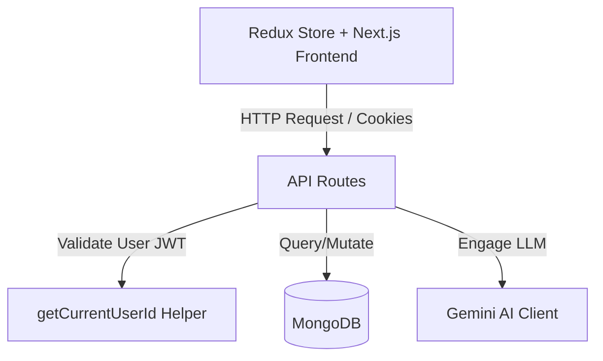
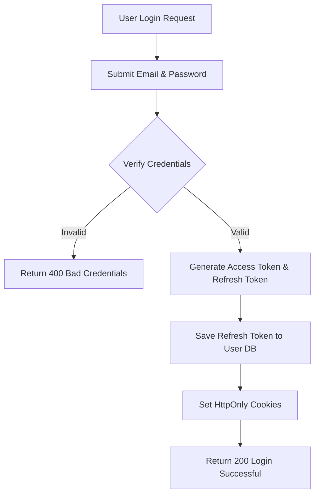
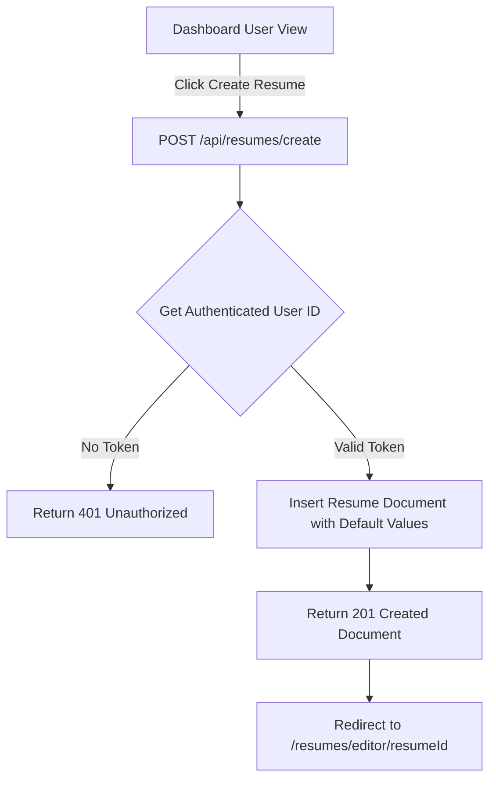
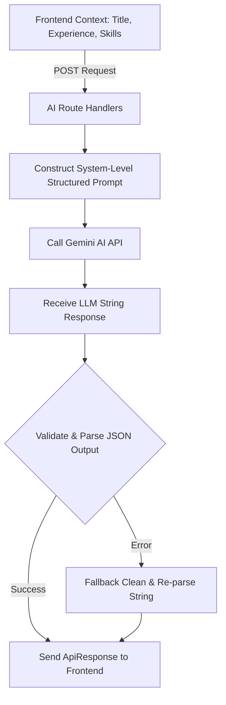
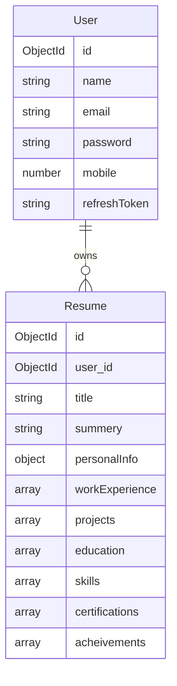

# PROJECT ANALYSIS: RESUME BUILDER SAAS (REDUX TOOLKIT EDITION)

This document serves as the comprehensive analysis of the existing backend services and structures, mapping them directly to a premium Redux Toolkit frontend architecture for the Resume Builder SaaS application.

---

## 1. Architecture Overview

The system follows a classic client-server model built on Next.js. The backend routes run as serverless function endpoints (Next.js Route Handlers) connecting to a MongoDB Atlas cluster via Mongoose. The frontend is a Next.js single-page-like experience powered by dynamic routing, React, Tailwind CSS, and Redux Toolkit.

### Authentication Flow (JWT + Cookies)
The authentication system is designed around stateless JWT tokens with cookie persistence:
1. **Registration/Login:** User submits credentials via POST `/api/auth/register` or `/api/auth/login`. On validation, the backend generates two JWTs: an Access Token (expiry: 15m) and a Refresh Token (expiry: 7d).
2. **Cookie Storage:** Both tokens are set in `HttpOnly`, `Secure`, `SameSite=Strict` cookies. The frontend cannot access these tokens via client-side JavaScript, protecting against XSS attacks.
3. **Session Persistence:** When a protected route is requested, the client browser automatically attaches the `accessToken` cookie. The backend verifies the token using the secret key.
4. **Token Rotation / Silent Refresh:** When the Access Token expires, the client calls `GET /api/auth/refresh`. The handler verifies the `refreshToken` cookie against the DB (`user.refreshToken`). If verified, a new Access Token is signed and sent in a new `Set-Cookie` header.

### Resume Management Flow
1. **Initialization:** The user clicks "Create Resume". A POST request to `/api/resumes/create` initializes a default resume template document linked to the user's ID.
2. **Fetch All:** Dashboard displays cards by calling `GET /api/resumes/get-all`.
3. **Retrieve/Update:** The editor pulls specific resume data using `GET /api/resumes/[resumeId]` and saves progress using incremental or full updates through `PATCH /api/resumes/[resumeId]`.

### AI Generation Flow
1. **Request:** The frontend gathers inputs (e.g., job title, skills, experience level) and sends a POST request to an AI route.
2. **Prompt Engineering:** The backend constructs an optimized system-level prompt and calls Google's Gemini API (`gemini-3.5-flash`).
3. **Parsing:** The backend parses Gemini's string response, formats it into a standard JSON shape, and returns it to the client.

### Database Relationships
*   **One-to-Many:** A `User` can own multiple `Resume` documents.
*   **Referential Integrity:** The `Resume` schema contains a `user_id` field referencing the `User` model.

---

## 2. API Documentation

| Route | Method | Purpose | Request Body | Response Body (Data payload) | Auth Required | Usage Location in Frontend |
| :--- | :--- | :--- | :--- | :--- | :--- | :--- |
| `/api/auth/register` | `POST` | Create new user account | `{ name, email, password, mobile }` | `{ user: IUser }` | No | `/register` page |
| `/api/auth/login` | `POST` | Authenticate user | `{ email, password }` | `{ user: IUser }` | No | `/login` page |
| `/api/auth/logout` | `GET` | Clear user session | `None` | `None` | Yes | Logout Button in Header/Settings |
| `/api/auth/me` | `GET` | Get current user details | `None` | `IUser` | Yes | App initializer / Auth store |
| `/api/auth/refresh` | `GET` | Rotate expired access token | `None` | `IUser` (Basic fields) | Yes (Refresh Cookie) | Axios response interceptor |
| `/api/resumes/create` | `POST` | Create a blank resume | `None` | `IResume` (Initialized) | Yes | Dashboard (Create Resume Button) |
| `/api/resumes/get-all` | `GET` | Fetch all user resumes | `None` | `IResume[]` | Yes | Dashboard |
| `/api/resumes/[resumeId]` | `GET` | Fetch a single resume | `None` | `IResume` | Yes | Resume Editor Page |
| `/api/resumes/[resumeId]` | `PATCH` | Update a resume's contents | `Partial<IResume>` | `IResume` (Updated) | Yes | Editor (Auto-save/Save actions) |
| `/api/ai/generate-summary` | `POST` | Generate resume summary | `{ experenceLevel, skills, jobTitle }` | `string` (Text summary) | Yes | Resume Editor (Summary AI Assistant) |
| `/api/ai/generate-skills` | `POST` | Suggest tech & soft skills | `{ expreenceLevel, jobTitle }` | `{ skills: string[] }` | Yes | Resume Editor (Skills AI Assistant) |
| `/api/ai/generate-experience-description` | `POST` | Generate work bullet points | `{ company, position, startDate, endDate, skills }` | `string[]` (4 bullet points) | Yes | Resume Editor (Experience AI assistant) |
| `/api/ai/generate-project-description` | `POST` | Generate project details | `{ projectTitle, jobTitle, techStack }` | `string[]` (4 bullet points) | Yes | Resume Editor (Project AI assistant) |
| `/api/ai/inprove-content` | `POST` | Improve content phrasing | `{ content }` | `string` (Improved text) | Yes | Editor inline writer |
| `/api/ai/ats-score` | `POST` | Analyze ATS compatibility | `{ resumeText }` | `{ score: number, strengths: string[], weaknesses: string[], suggestions: string[] }` | Yes | ATS Score Page |

---

## 3. TypeScript Documentation

Frontend models must directly implement these verified interfaces.

### `src/types/apiResponse.type.ts`
```typescript
export interface ApiResponse<T = any> {
    message: string;
    data?: T;
    error?: unknown;
    success: boolean;
}

export interface LooginBody {
    email: string;
    password: string;
}

export interface RegisterBody {
    name: string;
    email: string;
    password: string;
    mobile: number;
}
```

### `src/types/user.type.ts`
```typescript
export interface IUser {
    name: string;
    email: string;
    password?: string; // Optional on frontend, omitted for security
    mobile: number;
    refreshToken: string | null;
    createdAt?: string;
    updatedAt?: string;
}
```

### `src/types/resume.type.ts`
```typescript
import { Types } from "mongoose";

export interface IPersonalInfo {
    fullname: string;
    email: string;
    mobile: number;
    country: string;
    pincode: number;
    location: string;
    github: string;
    linkedin: string;
    prtfolio: string; // matches backend spelling error
}

export interface IWorkExperience {
    company: string;
    position: string;
    startDate: string;
    endDate: string;
    description: string;
}

export interface iProject {
    project: string; // project name/title
    description: string;
    githubLink: string;
    liveLink: string;
    techStack: string[];
}

export interface IEducation {
    institute: string;
    degree: string;
    startDate: string;
    endDate: string;
    description: string;
}

export interface IResume {
    _id?: string;
    user_id: string; // Cast from ObjectId to string for client consumption
    title: string;
    summery: string; // note backend spelling
    personalInfo: IPersonalInfo;
    workExperience?: IWorkExperience[];
    projects: iProject[];
    education: IEducation[];
    certifications?: string[];
    acheivements?: string[]; // note backend spelling
    skills: string[];
    createdAt?: string;
    updatedAt?: string;
}
```

### `src/types/ai.types.ts`
```typescript
export interface GenerateSummeryBody {
    experenceLevel: string;
    skills: string[];
    jobTitle: string;
}

export interface GenerateSkillsBody {
    expreenceLevel: string; // note backend spelling
    jobTitle: string;
}

export interface GenerateProjectDescriptionBody {
    projectTitle: string;
    jobTitle: string;
    techStack: string[];
}

export interface GenerateExperienceDescriptionBody {
    company: string;
    position: string;
    startDate: string;
    endDate: string;
    skills: string[];
}

export interface ImproveContentBody {
    content: string;
}

export interface ATSScoreBody {
    resumeText: string;
}
```

### Type Connections and Consumption
*   **Redux Store selectors** extract state typed to these interfaces.
*   **React Hook Form** coordinates UI inputs validating schemas shaped matching `IPersonalInfo`, `IWorkExperience[]`, `iProject[]`, etc.
*   **Axios HTTP Services** return `Promise<ApiResponse<T>>`, where `T` can be `IUser`, `IResume`, `IResume[]`, `string`, etc.

---

## 4. Model Documentation

### User Model
*   **Fields:**
    *   `name`: String, required.
    *   `email`: String, required, unique, lowercase.
    *   `password`: String, required, min length 6, excluded from queries by default (`select: false`).
    *   `mobile`: Number, required, unique.
    *   `refreshToken`: String, default `null`.
*   **Relationships:** Has many Resumes (`Resume.user_id` -> `User._id`).

### Resume Model
*   **Fields:**
    *   `user_id`: Mongoose ObjectId referencing the `User` model.
    *   `title`: String, default "My Resume".
    *   `summery`: String, default "My Resume summery".
    *   `personalInfo`: Nest object (fullname, email, mobile, country, pincode, location, github, linkedin, prtfolio).
    *   `workExperience`: Array of subdocuments (company, position, startDate, endDate, description).
    *   `projects`: Array of subdocuments (project, description, githubLink, liveLink, techStack).
    *   `education`: Array of subdocuments (institute, degree, startDate, endDate, description).
    *   `skills`: Array of strings, required.
    *   `certifications`: Array of strings, default `[]`.
    *   `acheivements`: Array of strings, default `[]`.

---

## 5. Mermaid Diagrams

### System Architecture



### Authentication Flow



### Resume Creation Flow



### AI Generation Flow



### Database Relationship Diagram



---

## 6. Frontend Architecture

To support scaling and enterprise quality, the frontend is organized cleanly into modular layers:

```
src/
├── app/
│   ├── (auth)/
│   │   ├── login/page.tsx
│   │   └── register/page.tsx
│   ├── dashboard/
│   │   └── page.tsx
│   ├── editor/
│   │   └── [resumeId]/
│   │       ├── page.tsx
│   │       └── ats/page.tsx
│   ├── layout.tsx
│   └── page.tsx
├── components/
│   ├── ui/                 # Primitives (Tailwind & Shadcn styled)
│   ├── shared/             # Header, Footer, Protected routes
│   └── editor/             # Section forms (PersonalInfo, WorkExperience, etc.)
├── hooks/                  # Custom hooks (e.g. useDebounce, Redux typed hooks)
├── services/               # API clients (auth, resumes, ai)
├── store/                  # Redux Toolkit store, provider, and features
│   ├── store.ts
│   ├── hooks.ts
│   └── features/
│       ├── auth/
│       ├── resume/
│       └── ai/
├── types/                  # Types matching backend models
└── utils/                  # String cleanups, layout calculations
```

### Folder Roles
*   **`services/`:** Isolates HTTP fetch/axios calls from page components. Makes replacing or caching API logic transparent.
*   **`store/`:** Redux Toolkit slices, thunks, selectors. Stores user profiles, resume lists, current open resume, AI status, and ATS reports.
*   **`hooks/`:** Reusable UI controls and RTK helpers. `hooks.ts` exports typed hooks (`useAppDispatch`, `useAppSelector`).

---

## 7. State Management Plan

1.  **Redux Toolkit (Global Server Cache & User Context):**
    *   `auth`: Tracks logged-in user profile (`IUser`), verification loading, error banners, and logged-in boolean.
    *   `resume`: Tracks full array of user resumes, currently opened resume instance, fetching lists loading state, patching state.
    *   `ai`: Tracks prompt feedback loading states, content improvement suggestions, and complete ATS scores history/details.
2.  **Local Component State (React `useState` / React Hook Form):**
    *   Form fields and validation rules inside the resume editor. (Form fields are explicitly kept out of Redux to prevent keypress delays).
    *   Active tabs in UI panels.
    *   Modal view open/close controls.

---

## 8. API Layer Design

The services leverage a shared `axios` client configured to send cookies automatically (`withCredentials: true`).

```
services/
├── api.client.ts          # Configures axios instance + interceptor for automatic access-token renewal
├── auth.service.ts        # Register, Login, Logout, Fetch User Profile
├── resume.service.ts      # Create, Read All, Read One, Patch Resume details
└── ai.service.ts          # Fetch suggestions for summary, skills, jobs, experience, score
```

### Core Service Interfaces

*   **`auth.service.ts`:**
    *   `register(data: RegisterBody)`: Register user.
    *   `login(data: LooginBody)`: Authenticates user.
    *   `logout()`: Clears token cookie session.
    *   `getCurrentUser()`: Validates current session on load.
*   **`resume.service.ts`:**
    *   `createResume()`: Sends POST request to create empty resume.
    *   `getAllResumes()`: Fetch all user documents.
    *   `getResumeById(id: string)`: Fetch single document.
    *   `updateResume(id: string, updates: Partial<IResume>)`: Patch updates.
*   **`ai.service.ts`:**
    *   `generateSummary(data: GenerateSummeryBody)`: POST to `/api/ai/generate-summary`.
    *   `generateSkills(data: GenerateSkillsBody)`: POST to `/api/ai/generate-skills`.
    *   `generateExperienceDescription(data: GenerateExperienceDescriptionBody)`: POST to `/api/ai/generate-experience-description`.
    *   `generateProjectDescription(data: GenerateProjectDescriptionBody)`: POST to `/api/ai/generate-project-description`.
    *   `improveContent(content: string)`: POST to `/api/ai/inprove-content`.
    *   `calculateATS(resumeText: string)`: POST to `/api/ai/ats-score`.

---

## 9. User Journey

```
Landing Page (Intro, Features, CTA)
  └── Login/Register Page (Sign up or access account)
        └── Dashboard View (List resumes, see timestamps, search/sort, create resume button)
              └── Resume Editor View (Sidebar Navigation, Dynamic form fields, AI helpers inline)
                    ├── Live Print Preview (PDF print margins, formatting preview, A4 aspect ratio)
                    └── ATS Scoring View (Detailed score meter, AI highlights, suggestion lists)
```

---

## 10. Missing Features & Refactoring Targets

1.  **Backend Route Protection Middleware:** There is currently no `middleware.ts` configured in Next.js to intercept requests at the edge. The routes instead rely on manually executing `getCurrentUserId` inside the controller body. This is a potential safety issue if a developer forgets to add the utility code.
2.  **Delete Route:** There is no `DELETE /api/resumes/[resumeId]` endpoint implemented in the backend. Users have no way to remove unwanted resumes.
3.  **Spelling Issues in Database Schemas:** 
    *   `summery` instead of `summary` (Resume schema)
    *   `acheivements` instead of `achievements` (Resume schema)
    *   `prtfolio` instead of `portfolio` (Resume personal info schema)
    *   `expreenceLevel` instead of `experienceLevel` (GenerateSkillsBody request payload)
    *   `experenceLevel` instead of `experienceLevel` (GenerateSummeryBody request payload)
    *   `/api/ai/inprove-content` instead of `/api/ai/improve-content` (Route path name)
    
    *Strict frontend implementation must match these exact keys unless the backend is refactored.*
